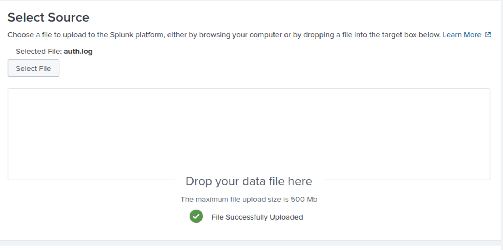
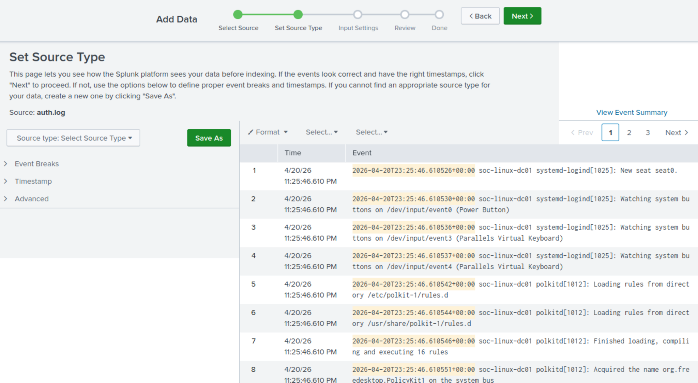
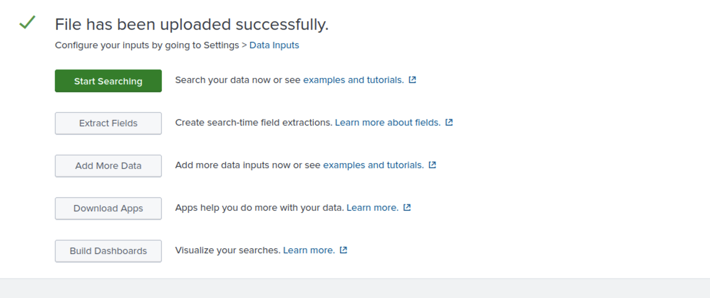
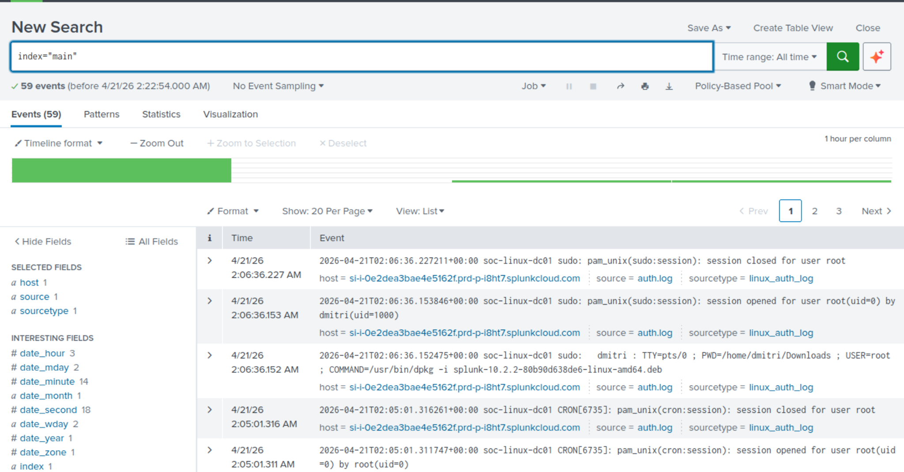
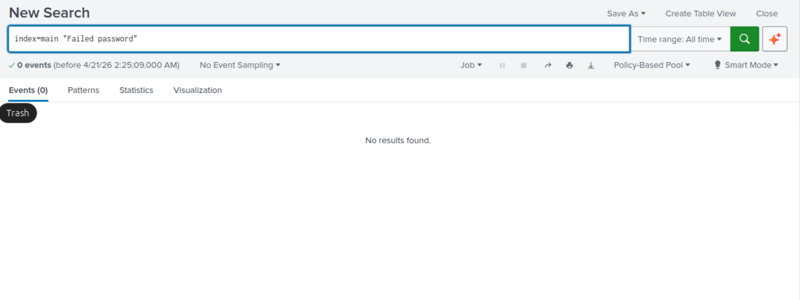
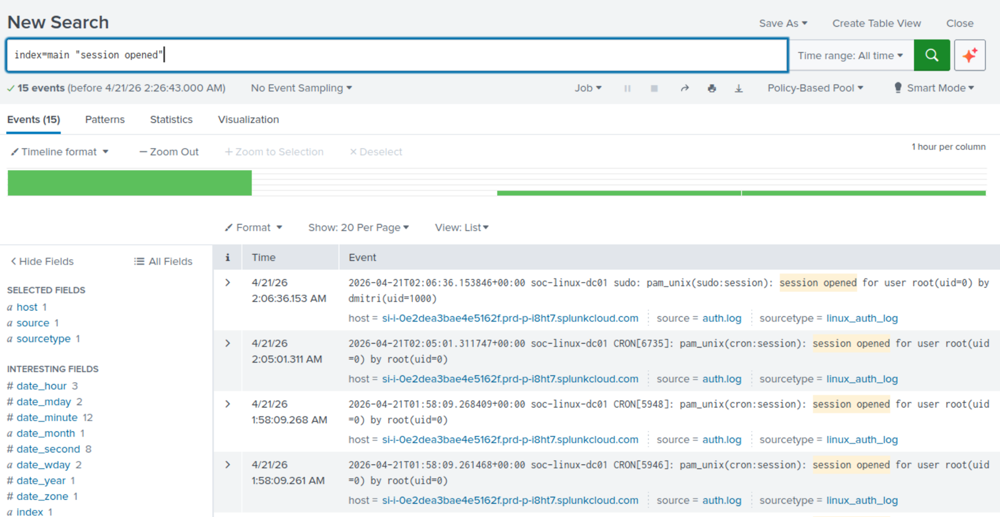
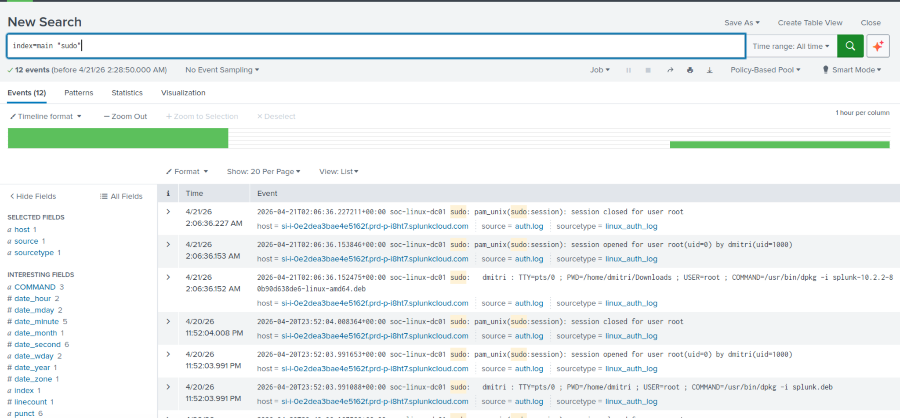
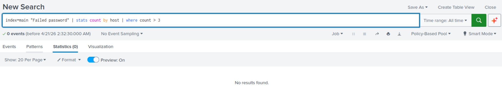
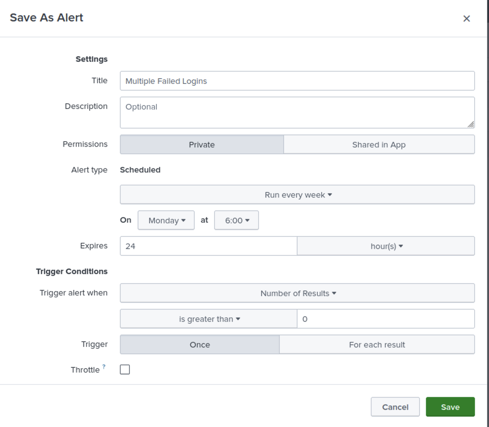

# Project 9 – Splunk SOC Detection: Multiple Failed Logins


---

## Overview

This project demonstrates how to ingest Linux authentication logs into **Splunk** and build a detection for multiple failed login attempts — a common SOC use case for identifying brute-force attacks. Starting from raw log upload, the investigation progresses through SPL query development, log analysis across four detection categories, and alert creation with scheduled trigger conditions.

> **Detection Built:** `index=main "Failed password" | stats count by host | where count > 3`
> **Alert:** Multiple Failed Logins — triggers when results > 0, scheduled weekly.

---

## Environment

| Tool | Purpose |
|------|---------|
| Splunk Cloud | SIEM platform for log ingestion and search |
| Linux `auth.log` | Authentication log dataset from `soc-linux-dc01` |
| SPL (Search Processing Language) | Query language for detection logic |
| GitHub | Documentation and version control |

---

## Data Source

| Property | Value |
|----------|-------|
| Log File | `auth.log` |
| Host | `soc-linux-dc01` |
| Source Type | `linux_auth_log` |
| Index | `main` |
| Total Events Ingested | 59 events |
| Time Range | April 20–21, 2026 |

---

## Project Steps

---

### 🟢 Step 1 — Data Ingestion

**Actions Taken:**
1. Navigated to Splunk **Add Data** → Upload
2. Selected `auth.log` from local filesystem — confirmed **File Successfully Uploaded**
3. Proceeded to **Set Source Type** — Splunk parsed events with correct timestamps
4. Confirmed all 8+ events previewed correctly before indexing
5. Completed ingestion — confirmed **File has been uploaded successfully**

**SPL used after ingestion:**
```spl
index="main"
```


*auth.log selected and uploaded successfully — file ready for ingestion*


*Set Source Type — Splunk parsing auth.log events with correct timestamps from soc-linux-dc01*


*File successfully uploaded confirmation — data ingested and ready for search*

---

### 🔵 Step 2 — Log Exploration

**Actions Taken:**
1. Ran baseline search to confirm all events indexed correctly
2. Verified 59 total events returned across the full time range
3. Confirmed sourcetype `linux_auth_log`, source `auth.log`, host `soc-linux-dc01`
4. Reviewed event content including sudo sessions, CRON activity, and PAM events

**SPL:**
```spl
index="main"
```

**Result:** 59 events — sudo sessions, PAM authentication, CRON, and system activity visible


*index=main returning 59 events — full auth.log dataset visible in Splunk with correct fields*

---

### 🟡 Step 3 — Failed Login Detection

**Actions Taken:**
1. Filtered for failed password events using keyword search
2. Query returned 0 events — the ingested `auth.log` did not contain failed password attempts
3. Result documented as expected behavior — the log captured system activity, not a brute-force scenario
4. Detection query validated and confirmed ready for alert creation

**SPL:**
```spl
index=main "Failed password"
```

**Result:** 0 events — no failed login attempts present in this auth.log dataset


*index=main "Failed password" returning 0 events — no brute-force activity in this dataset*

---

### 🟠 Step 4 — Session Activity Analysis

**Actions Taken:**
1. Queried for all session open events to identify authentication and privilege escalation activity
2. Confirmed 15 events returned — root sessions opened via sudo and CRON
3. Identified `session opened for user root(uid=0) by dmitri(uid=1000)` — sudo escalation visible
4. CRON root sessions also captured — baseline system behavior documented

**SPL:**
```spl
index=main "session opened"
```

**Result:** 15 events — root sessions via sudo (dmitri) and CRON captured


*index=main "session opened" — 15 events showing root session activity including sudo escalation by dmitri*

---

### 🔴 Step 5 — Privileged Command Monitoring

**Actions Taken:**
1. Queried for all sudo-related events to surface privileged command execution
2. Confirmed 12 events returned — sudo sessions, PAM events, and command execution logged
3. Identified `dmitri : TTY=pts/0 ; USER=root ; COMMAND=/usr/bin/dpkg -i splunk...` — Splunk install via sudo captured
4. Confirmed sudo audit trail fully visible in Splunk from the same auth.log source

**SPL:**
```spl
index=main "sudo"
```

**Result:** 12 events — full sudo command history including Splunk installation captured


*index=main "sudo" — 12 events showing sudo sessions and privileged commands including Splunk install*

---

### 🟣 Step 6 — Detection Query & Alert Creation

**Actions Taken:**
1. Built final detection query using SPL stats and threshold filter
2. Ran query — returned 0 results confirming no brute-force hosts in this dataset (expected)
3. Saved query as a **Scheduled Alert** in Splunk with the following configuration:

**Detection SPL:**
```spl
index=main "Failed password" | stats count by host | where count > 3
```

**Alert Configuration:**
| Setting | Value |
|---------|-------|
| Alert Name | Multiple Failed Logins |
| Alert Type | Scheduled |
| Schedule | Every week — Monday at 6:00 |
| Expires | 24 hours |
| Trigger Condition | Number of Results is greater than 0 |
| Trigger | Once |


*Detection SPL — stats count by host where count > 3, returning 0 results confirming clean dataset*


*Save As Alert — "Multiple Failed Logins" configured with scheduled trigger and results > 0 condition*

---

## SPL Query Reference

| Query | Purpose | Events Returned |
|-------|---------|----------------|
| `index="main"` | Baseline — all events | 59 |
| `index=main "Failed password"` | Brute-force detection | 0 |
| `index=main "session opened"` | Session activity analysis | 15 |
| `index=main "sudo"` | Privileged command monitoring | 12 |
| `index=main "Failed password" \| stats count by host \| where count > 3` | Detection rule | 0 (clean dataset) |

---

## Screenshot Naming Reference

| File Name | Description |
|-----------|-------------|
| `01-data-upload.png` | auth.log uploaded successfully in Splunk Add Data |
| `02-data-ingestion.png` | Set Source Type — events parsed with correct timestamps |
| `03-data-ingested.png` | File ingestion confirmed — ready to search |
| `04-all-logs.png` | index=main — 59 events returned, all fields confirmed |
| `05-failed-logins.png` | index=main "Failed password" — 0 events, clean dataset |
| `06-session-activity.png` | index=main "session opened" — 15 root session events |
| `07-sudo-activity.png` | index=main "sudo" — 12 privileged command events |
| `08-detection-query.png` | Final detection SPL with stats and threshold filter |
| `09-alert-created.png` | Save As Alert — Multiple Failed Logins scheduled alert |

---

## Skills Demonstrated

| Skill | How It Was Applied |
|-------|--------------------|
| SIEM Data Ingestion | Uploaded and indexed Linux auth.log into Splunk Cloud |
| Log Source Configuration | Set source type and validated event parsing before indexing |
| SPL Query Development | Built 5 progressive queries from baseline to detection rule |
| Failed Login Detection | Constructed brute-force detection using stats and threshold filter |
| Session Activity Analysis | Queried and reviewed PAM session open events across the dataset |
| Privileged Command Monitoring | Surfaced sudo activity and identified command execution in logs |
| Detection Engineering | Translated detection logic into a scheduled Splunk alert |
| Alert Configuration | Configured trigger conditions, schedule, and expiry for production-ready alert |

---

## Lessons Learned

**Clean data still teaches detection engineering.** The auth.log dataset didn't contain any failed login attempts — but that didn't make the project less valuable. Building the detection query, validating it against a clean dataset, and confirming 0 results is exactly how detection rules are tested before deployment. A false positive is a problem. Zero results on a clean dataset is a green light.

**Auth logs are one of the richest sources in a SOC.** A single auth.log file surfaced sudo escalation, CRON root sessions, PAM authentication events, and command execution history — all from one source. In production, this is the log that tells you who ran what, as whom, and when. Knowing how to query it in a SIEM is a foundational SOC skill.

**SPL is a force multiplier.** The difference between `index=main "sudo"` and `index=main "Failed password" | stats count by host | where count > 3` is the difference between browsing logs and building detections. Adding `stats`, `count`, and `where` turns keyword search into a threshold-based alert that can fire automatically — no analyst required to check it manually.

---

## Repository Structure

```text
Project-11-Splunk-SOC-Detection/
├── Project Screenshots/
│   ├── 01-data-upload.png
│   ├── 02-data-ingestion.png
│   ├── 03-data-ingested.png
│   ├── 04-all-logs.png
│   ├── 05-failed-logins.png
│   ├── 06-session-activity.png
│   ├── 07-sudo-activity.png
│   ├── 08-detection-query.png
│   └── 09-alert-created.png
└── README.md
```

---

## References

- [Splunk SPL Documentation](https://docs.splunk.com/Documentation/Splunk/latest/SearchReference/WhatsInThisManual)
- [Splunk Alert Configuration](https://docs.splunk.com/Documentation/Splunk/latest/Alert/Definescheduledalerts)
- [MITRE ATT&CK — Brute Force (T1110)](https://attack.mitre.org/techniques/T1110/)
- [Linux auth.log Reference](https://www.man7.org/linux/man-pages/man8/pam_unix.8.html)
